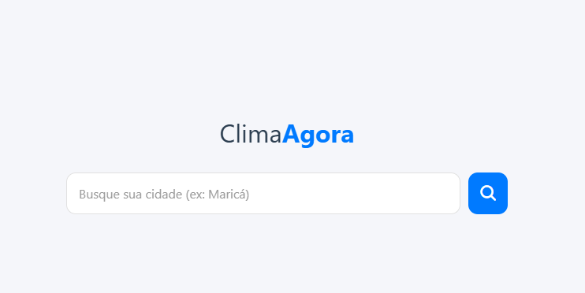
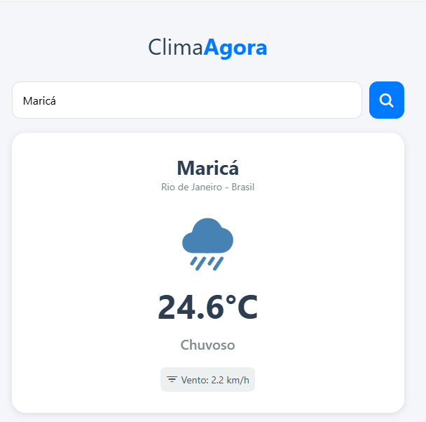
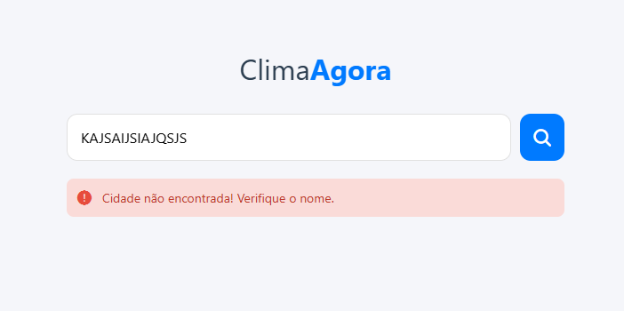

# 🌤️ ClimaAgora

Um aplicativo móvel elegante e eficiente para previsão do tempo em tempo real, construído com a robustez do **React Native** e **TypeScript**.

---

## 📋 Sobre o Projeto

O **ClimaAgora** é uma aplicação mobile desenvolvida para oferecer consultas meteorológicas rápidas e precisas.

O projeto foi arquitetado com foco em:

- **Clean Code**
- **UX responsiva**
- **Boas práticas de arquitetura**
- **Tipagem estática (Type-Safe)**

A interface se adapta perfeitamente a dispositivos móveis e também funciona via Web utilizando o ecossistema do Expo.

A forte tipagem via **TypeScript** garante maior estabilidade, legibilidade e segurança no desenvolvimento.

---
## 🎨 Galeria de telas

| Tela Inicial | Resultado | Erro |
|--------------|-----------|------|
|  |  |  |
---
## ✨ Funcionalidades (Core Features)

O aplicativo contempla os requisitos funcionais e os aprimora com boas práticas modernas:

### 🔍 1. Busca Inteligente
- Campo de entrada com sanitização de dados:
  - `trim()`
  - `encodeURIComponent()`
- Evita consultas inválidas ou corrompidas.

### 📡 2. Integração via API
- Consumo assíncrono da **Open-Meteo API**:
  - Geocoding
  - Previsão do tempo (Forecast)

### ⚡ 3. Feedback Visual
- Utilização de `ActivityIndicator` para melhorar o UX.

### 🎨 4. UI Dinâmica
- Ícones e descrições climáticas variam automaticamente:
  - Ex.: *"Céu Limpo"*, *"Tempestade"*, *"Chuvisco"*.

### 🛡️ 5. Tratamento Robusto de Erros
- Estrutura `try/catch` garante resiliência mesmo com:
  - Falhas de rede
  - Cidades inexistentes
  - Dados inconsistentes da API

---

## 🚀 Tecnologias Utilizadas

Este projeto foi desenvolvido com o que há de mais atual no ecossistema React Native:

- **React Native** — Framework principal
- **Expo** — Build, Dev Tools e suporte multiplataforma
- **TypeScript** — Tipagem estática e segurança
- **Expo Router** — Roteamento baseado em arquivos (file-system routing)
- **Open-Meteo API** — Geocoding + Weather Forecast
- **Ionicons** — Biblioteca de ícones vetoriais moderna

---
## 🔧 Como Executar o Projeto

Siga os passos abaixo para rodar o projeto localmente.

### ✔️ Pré-Requisitos
- **Node.js** instalado

### 📥 1. Clone o repositório - git clone

```bash
https://github.com/tassianasc/clima_agora.git
```
## 🚀 Como executar o projeto

### Acesse a pasta do projeto:
```bash
cd clima-agora
```
### Instale as dependências:
```bash
npm install
# ou
yarn install
```
### Execute o projeto:
```
npx expo start
```
### 📱 No seu celular

1. Baixe o app **Expo Go** (App Store ou Google Play).

2. Escaneie o **QR Code** exibido no terminal.

## 📂 Estrutura do Projeto

A arquitetura segue o padrão do **Expo Router:**
```
clima-agora/
├── app/
│   ├── (tabs)/
│   │   ├── index.tsx      # Tela Principal (Lógica do Clima)
│   │   ├── _layout.tsx    # Configuração das Abas (Tab Navigation)
│   │   └── explore.tsx    # Tela Secundária
│   └── _layout.tsx        # Layout Raiz
├── assets/                # Imagens e Fontes
├── constants/             # Constantes globais (Cores, Configurações)
├── components/            # Componentes reutilizáveis
└── package.json           # Dependências e Scripts
```
## 🧠 Decisões Técnicas
**Uso de TypeScript**

Optou-se pelo uso de arquivos .tsx para garantir tipagem forte, permitindo definir contratos de interface como WeatherData. Isso evita erros como "undefined is not an object" ao manipular dados da API.

**Gerenciamento de Estado**

Utilização de useState, suficiente para a complexidade atual e evitando adicionar bibliotecas mais pesadas como Redux ou Context API sem necessidade.

**Estilização Nativa**

Uso de StyleSheet para garantir maior performance na renderização de componentes nativos.
